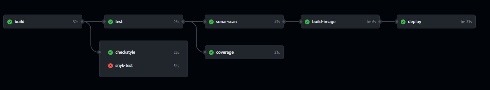

# Devops Project

## Кратко описание

Финален курсов проект по курса Съвременни DevOps практики

### Technologies Used

- Java
- Gradle
- Snyk
- SonarCloud
- Docker
- Minikube

## GitHub Actions Workflows

### Етапи

1. Build - използвам `Gradle` за буилдването на приложението
2. test, checkstyle, snyk-test
* test - изпълняват се тестовете на приложението
* checkstyle - проверява дали се е следвало определения `checkstyle` при форматирането на кода
* snyk-test - проверява за уязвимостти при dependency-тата
3. sonar-scan и coverage 
* sonar-scan - изпълява се само на `main` branch-a - извършва static code analysis с помощта на SonarCloud. Проверява за качеството на кода и уязвимости
* coverage - проверява дали тестовете покриват достатъчна част от кода
4. build-image - изпълява се само на `main` branch-a - буилдва `Docker image` на приложението и го качва в `DockerHub`
5. deploy - изпълява се само на `main` branch-a - деплова приложението на локално пуснат `Minikube`

